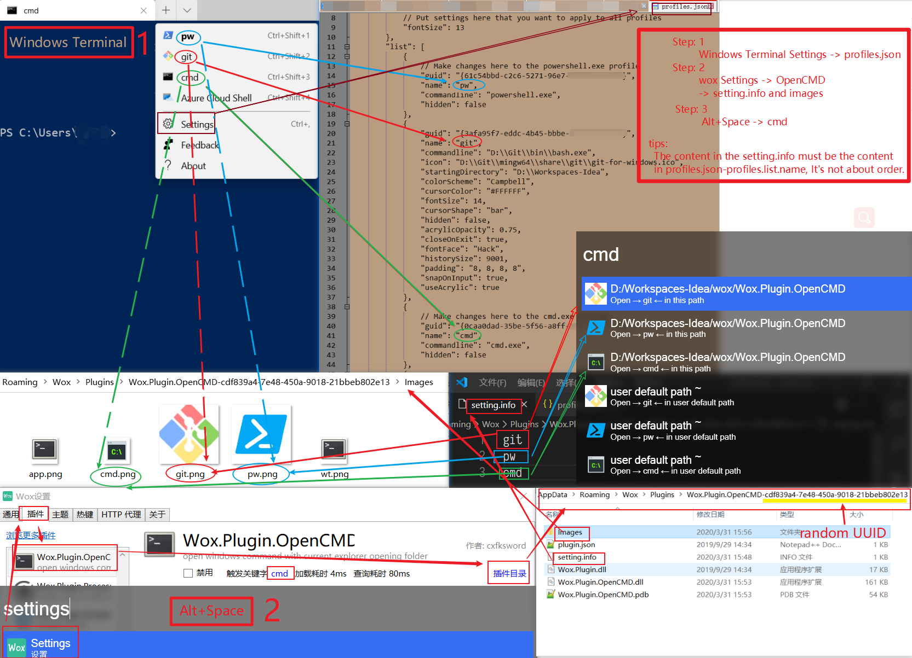

Wox.Plugin.OpenCMD
==================

An [Wox](https://github.com/qianlifeng/Wox) plugin that easy to open a shell in current opening explorer

# Usage

1. Open explorer and goto your directory.
2. Awake Wox.
3. Type `op` and press `Enter`, then will open a shell in current directory.

#  Tip
You need to open in [Windows Terminal](https://github.com/Microsoft/Terminal), you **MUST** set the `CMDER_ROOT` environment variable(Must be a directory for wt.exe), 

| **VARIABLE** | **VALUE**                                                  |
| :----------- | ---------------------------------------------------------- |
| CMDER_ROOT   | C:\Users\\`{username}`\AppData\Local\Microsoft\WindowsApps |

# Settings:
## Step:one:

​	Windows Terminal Settings -> profiles.json

## Step:two:

​	wox Settings -> OpenCMD -> setting.info and images

